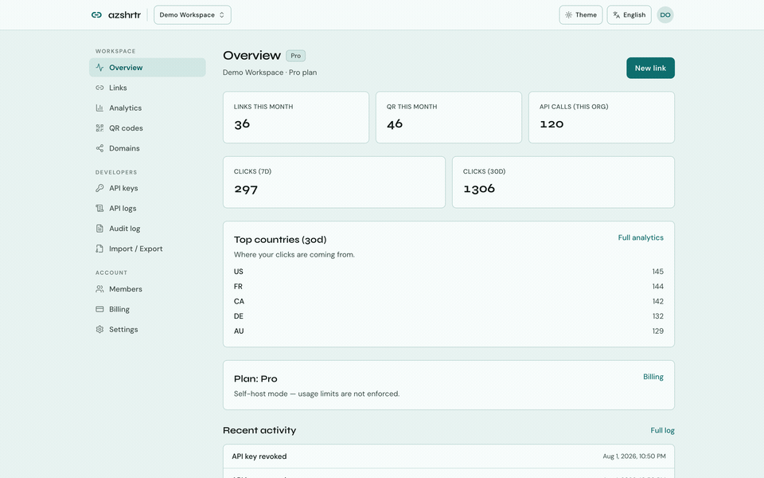
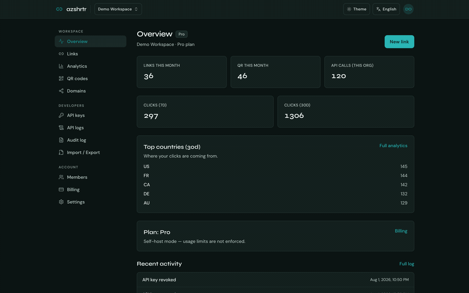

# Azshrtr

Open-source URL shortener and QR platform. Self-host or use [Azshrtr Cloud](https://azshrtr.com/).

Laravel 13 · PHP 8.5+ · React console · MariaDB · OpenAPI

**By [Azodik Consulting Private Limited](https://azodik.com)** · [github.com/azodik/azshrtr](https://github.com/azodik/azshrtr)

[](LICENSE)
[](https://github.com/sponsors/azodik)

<p align="center">
  
</p>

<details>
<summary>Dark mode walkthrough</summary>
<p align="center">
  
</p>
</details>

## Features

- Anonymous homepage shorten → claim later (or expire in 30 minutes)
- Marketing site with brand-first hero shortener
- Console for links, QR, domains, API keys, audit log, import/export, billing
- Free / Pro ($20/year) on Cloud; unlimited when billing is off (self-host)
- First-class REST API (`/api/v1` Bearer `az_live_` / `az_test_` keys)
- OpenAPI 3.1 at [`/openapi.yaml`](public/openapi.yaml) + Stoplight Elements explorer at `/docs/api-explorer`
- Cloudflare for SaaS custom domains; Dodo Payments
- Shared-hosting friendly (database queue/cache; 1-minute cron)

## Cloud plans (Azshrtr Cloud)

| Plan | Price | Highlights |
|------|-------|------------|
| Free | $0 | 3,000 short URLs / month · 300 QR / month · 2 API keys |
| Pro | $20/year | Unlimited links & QR · custom domains + SSL · password links · 20 API keys |

Self-host remains free forever (`AZSHRTR_BILLING_ENABLED=false`).

## Requirements

- PHP 8.5+
- Composer 2
- Node.js 24+
- MariaDB 10.11+ (SQLite OK for local/demo only)
- Redis optional

## Install

Pick one path. After install, open `/docs` for the same guides in the app.

### Laravel Herd (macOS)

```bash
git clone https://github.com/azodik/azshrtr.git
cd azshrtr
herd link azshrtr && herd secure azshrtr
composer install
cp .env.example .env && php artisan key:generate
# Create MariaDB database `azshrtr`, set DB_* in .env, then:
php artisan azshrtr:setup
npm install && npm run build
# optional rich console demo:
php artisan db:seed --class=ConsoleDemoSeeder
```

- Site: https://azshrtr.com · Docs: https://azshrtr.com/docs · Console: https://azshrtr.com/console

### Without Docker (PHP / Nginx or Apache)

```bash
git clone https://github.com/azodik/azshrtr.git
cd azshrtr
composer install
cp .env.example .env && php artisan key:generate
# Point the web server document root at `public/`
# Set DB_* in .env, create the database, then:
php artisan azshrtr:setup
npm install && npm run build
```

### Docker Compose

```bash
cp .env.example .env
php artisan key:generate   # APP_KEY is required by the app container
docker compose up --build
```

App: [http://localhost:8080](http://localhost:8080) · MariaDB on host port `3307` · Redis on `6381`.

The runtime image is Alpine-based (`php:8.5-fpm-alpine` + nginx) and runs php-fpm, nginx, the queue worker, and the scheduler.

### Shared hosting

On some shared hosting, the web root is `public_html/`. Deploy from the app root:

```bash
cd ~/domains/your-domain.com
./deploy.sh
# PHP_CLI=/opt/alt/php85/usr/bin/php ./deploy.sh
```

That runs Composer, migrate, idempotent seeders, caches, syncs `public/` → `public_html/`, and prepares the scheduler wrapper.

Control-panel cron (every minute — shell operators are often unavailable):

```text
/bin/bash /home/USER/domains/your-domain.com/scripts/run-scheduler.sh
```

Helpers:

| Script | Purpose |
|--------|---------|
| [`deploy.sh`](deploy.sh) | Full shared-hosting deploy |
| [`scripts/sync-public-to-public-html.sh`](scripts/sync-public-to-public-html.sh) | `public/` → `public_html/` + storage symlink |
| [`scripts/run-scheduler.sh`](scripts/run-scheduler.sh) | One `schedule:run` for cron |

Defaults use `CACHE_STORE=database`, `QUEUE_CONNECTION=database`, `SESSION_DRIVER=database`. Set `AZSHRTR_CRON_QUEUE=true` so the scheduler drains the queue each minute. See `/docs/shared-hosting`.

## Demo user (optional)

```bash
php artisan db:seed --class=ConsoleDemoSeeder
# or: php artisan azshrtr:setup --with-demo
```

| Field | Value |
|-------|-------|
| Email | `demo@azshrtr.com` |
| Password | `password` |
| Console | `/console` |

Local/testing only — the seeder refuses to run in production.

## API

| Resource | URL |
|----------|-----|
| OpenAPI 3.1 | [`/openapi.yaml`](public/openapi.yaml) |
| API overview | `/docs/api` |
| API explorer (Stoplight Elements) | `/docs/api-explorer` |
| Health | `GET /api/v1/health` |
| Product API | Bearer `az_test_…` / `az_live_…` on `/api/v1/me`, `/api/v1/links…` |

Product scopes: `links:read`, `links:write`, `qr:write`, `domains:read`, `analytics:read`.

```bash
curl -s "$APP_URL/api/v1/me" \
  -H "Authorization: Bearer $AZSHRTR_API_KEY" \
  -H "Accept: application/json"
```

## Dodo Payments (Azshrtr Cloud billing)

Needed only for paid Pro checkout. Self-host can skip this (`AZSHRTR_BILLING_ENABLED=false`).

1. Put your Dodo **test** API key in `.env`:

```env
DODO_PAYMENTS_API_KEY=your_test_api_key
DODO_PAYMENTS_ENVIRONMENT=test_mode
DODO_PAYMENTS_RETURN_URL="${APP_URL}/console/{organization_id}/billing"
```

2. Create or sync the yearly Pro product, write `DODO_PRODUCT_PRO` into `.env`, and sync billing plans:

```bash
php artisan setup:dodo
```

Re-run after price changes — it PATCHes the existing Dodo product. Use `--force` only when you want a new product ID.

3. For webhooks, use a public HTTPS URL (production or a tunnel) and register:

```bash
php artisan setup:dodo --webhook=https://<your-host>/api/v1/webhooks/dodo
```

That writes `DODO_PAYMENTS_WEBHOOK_SECRET`. Webhook path is always `POST /api/v1/webhooks/dodo`.

4. Enable Cloud billing:

```env
AZSHRTR_BILLING_ENABLED=true
```

## Tests & quality

```bash
./vendor/bin/pint --test
npm run typecheck
npm run lint
composer test
```

PHPUnit covers product + console APIs in `tests/Feature/` (`ProductApiTest`, `ConsoleApiIntegrationTest`, `AuthSessionApiTest`, `WebhookApiTest`, `OpenApiAndDocsTest`).

Optional browser smoke:

```bash
npm run test:e2e:install
npm run test:e2e
```

Regenerate README console walkthrough GIFs (Herd site + demo seed + ffmpeg):

```bash
php artisan db:seed --class=ConsoleDemoSeeder
npm run demo:capture
```

## Versioning

SemVer lives in [`VERSION`](VERSION) (mirrored in `package.json`). See [`CONTRIBUTING.md`](CONTRIBUTING.md).

## Docs & support

- In-app docs: `/docs`
- Legal: `/privacy`, `/terms`, `/cookies`
- SEO: `/sitemap.xml`, `/robots.txt`
- Issues: [github.com/azodik/azshrtr/issues](https://github.com/azodik/azshrtr/issues)
- Security-sensitive findings: prefer a private report to Azodik Consulting Private Limited via [azodik.com](https://azodik.com) rather than a public issue.

## Sponsor Azshrtr

**Self-hosting stays free forever.** Sponsorship is optional — it keeps that promise sustainable.

Azshrtr is the short-link layer in front of your campaigns and apps: guest shorten, claim, QR, domains, API keys, and audit. If you run it in production, you already depend on someone shipping fixes, reviewing contributions, and maintaining releases. That work does not pay for itself through license fees.

**Why sponsor**

- **Keep self-host free** — MIT, no forced Cloud upsell, no paywall on core shortening
- **Fund security & maintenance** — dependency updates, CVE response, release engineering
- **Shape the roadmap** — sponsors help prioritize domains, API DX, and self-host ergonomics
- **Say thanks with signal** — stars help discovery; Sponsors keep the lights on

**Who this is for**

| You… | Consider |
|------|----------|
| Self-host Azshrtr for a product or company | A monthly or one-time Sponsor — you rely on the project staying healthy |
| Prefer zero ops | [Azshrtr Cloud](https://azshrtr.com) plans (optional managed hosting) |
| Just exploring | Star the repo and open issues — still valuable |

<p align="center">
  <a href="https://github.com/sponsors/azodik"></a>
</p>

→ **[github.com/sponsors/azodik](https://github.com/sponsors/azodik)**

## License

[MIT](LICENSE) · © Azodik Consulting Private Limited
